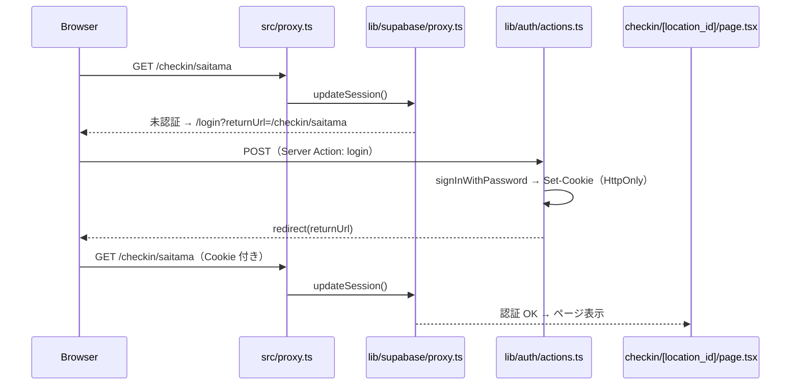

# プロジェクト構成

NFC チェックインシステム（`nfc_checkin`）のファイル・フォルダ構成と役割の一覧。

最終更新: 2026-09-02

> **メンテナンス**: このファイルはプロジェクト構成の正本。`src/` の追加・削除・移動やルーティング変更があった作業では、AI エージェントが同じ作業内で内容を更新する（`AGENTS.md` 参照）。

---

## 全体ツリー

```
nfc_checkin/
├── AGENTS.md                          # AI エージェント向けルール
├── CLAUDE.md                          # AGENTS.md への参照入口
├── README.md                          # セットアップ・デプロイ手順
├── env.example                        # 環境変数テンプレート
├── eslint.config.mjs                  # ESLint 設定
├── next.config.ts                     # Next.js 設定
├── next-env.d.ts                      # Next.js 型定義（自動生成・手編集不可）
├── package.json                       # 依存関係・npm スクリプト
├── package-lock.json                  # 依存バージョン固定
├── postcss.config.mjs                 # PostCSS / Tailwind 設定
├── tsconfig.json                      # TypeScript 設定
│
├── docs/                              # ドキュメント
│   ├── project-structure.md           # このファイル
│   ├── requirements.md                # 要件定義
│   ├── implementation-plan.md         # 実装計画（STEP 1〜8）
│   └── journal/                       # 日次作業記録
│       ├── README.md                  # ジャーナルの運用ルール
│       ├── project-files.md           # 旧版のファイル一覧（参照用）
│       └── YYYY-MM-DD.md              # 日ごとの作業ログ
│
├── public/                            # 静的ファイル（URL 直配信）
│   ├── file.svg
│   ├── globe.svg
│   ├── next.svg
│   ├── vercel.svg
│   └── window.svg
│
└── src/                               # アプリケーション本体
    ├── proxy.ts                       # リクエスト前処理（認証・セッション）
    │
    ├── app/                           # Next.js App Router（画面）
    │   ├── layout.tsx                 # 全ページ共通レイアウト
    │   ├── page.tsx                   # ホーム（/）
    │   ├── globals.css                # グローバル CSS（Tailwind）
    │   ├── favicon.ico                # ファビコン
    │   ├── logout-button.tsx          # ログアウトボタン（Server Action を呼ぶ form）
    │   │
    │   ├── login/                     # ログイン画面
    │   │   ├── page.tsx               # /login
    │   │   └── login-form.tsx         # ログインフォーム（Client Component）
    │   │
    │   └── checkin/
    │       └── [location_id]/
    │           └── page.tsx           # チェックイン画面（/checkin/:id）
    │
    └── lib/                           # 共通ロジック
        ├── locations.ts               # 施設マスタ・バリデーション
        ├── auth/                      # 認証（ログイン・ログアウト・returnUrl）
        │   ├── actions.ts             # ログイン / ログアウトの Server Action
        │   └── return-url.ts          # ログイン後 URL の安全チェック
        └── supabase/                  # Supabase 接続
            ├── client.ts              # ブラウザ用クライアント（認証には使わない）
            ├── server.ts              # サーバー用クライアント
            ├── cookie-options.ts      # 認証 Cookie 設定
            └── proxy.ts               # セッション更新・認証ガード
```

---

## ルーティング対応表

| URL | ファイル | 説明 |
|-----|----------|------|
| `/` | `src/app/page.tsx` | 各施設チェックイン URL へのリンク一覧 |
| `/login` | `src/app/login/page.tsx` | ログイン画面（未認証時にリダイレクト） |
| `/checkin/saitama` | `src/app/checkin/[location_id]/page.tsx` | 埼玉/熊谷のチェックイン |
| `/checkin/obuse` | 同上 | 小布施のチェックイン |
| `/checkin/aichi` | 同上 | 愛知のチェックイン |
| `/checkin/不正なID` | 同上 | 404（`notFound()`） |

---

## ディレクトリ別の役割

### ルート — プロジェクト設定

| ファイル | 役割 |
|----------|------|
| `package.json` | 依存ライブラリ（Next.js 16, React 19, Supabase など）と `npm run dev/build/start/lint` |
| `tsconfig.json` | TypeScript 設定。`@/*` が `src/*` に解決される |
| `next.config.ts` | Next.js のビルド・実行設定 |
| `eslint.config.mjs` | コード品質チェック |
| `postcss.config.mjs` | Tailwind CSS v4 用 PostCSS 設定 |
| `env.example` | 必要な環境変数のテンプレート（本物のキーは入れない） |
| `.gitignore` | Git 管理外ファイル（`node_modules`, `.env*`, `.next` など） |

### `src/app/` — 画面（App Router）

Next.js の App Router 規約に従い、フォルダ構造が URL に対応する。

| ファイル | 種別 | 役割 |
|----------|------|------|
| `layout.tsx` | Server | 全ページ共通の HTML 構造・フォント・メタデータ |
| `page.tsx` | Server | ホーム画面。`LOCATIONS` から施設リンクを生成 |
| `globals.css` | — | Tailwind 読み込みと基本スタイル |
| `logout-button.tsx` | Server | `logout` Server Action を submit し `/` へリダイレクト |
| `login/page.tsx` | Server | ログイン画面。`returnUrl` クエリを安全に検証 |
| `login/login-form.tsx` | Client | フォームを `login` Server Action に送信。エラー表示と送信中状態 |
| `checkin/[location_id]/page.tsx` | Server | チェックイン完了画面。名前・写真・申し込み情報を表示し、`checkins` に成功記録を1行書く |

`[location_id]` は動的セグメント。URL の `saitama` などが `params.location_id` として渡る。

### `src/lib/` — ビジネスロジック・インフラ

| ファイル | 役割 |
|----------|------|
| `locations.ts` | 施設 ID と名称の対応（`saitama` → 埼玉/熊谷 など）。`isValidLocationId()` でバリデーション |
| `auth/actions.ts` | サーバー側で `signInWithPassword` / `signOut`。成功時は Cookie を書いてリダイレクト |
| `auth/return-url.ts` | `returnUrl` が `/checkin/` 配下か検証し、不正なら `/` |
| `supabase/client.ts` | ブラウザ用クライアント。認証 Cookie は httpOnly のためログイン・ログアウトには使わない |
| `supabase/server.ts` | Server Component / Server Action から Supabase に接続 |
| `supabase/cookie-options.ts` | 認証 Cookie（365 日・HttpOnly・SameSite=Lax。本番は Secure） |
| `supabase/proxy.ts` | セッション更新、未認証時の `/login` リダイレクト、ログイン済み時の `/login` 回避 |

### `src/proxy.ts` — リクエスト前処理

Next.js 16 の Proxy（旧 Middleware 相当）。全リクエスト（静的ファイル除く）で `updateSession()` を実行する。

```
リクエスト
  → src/proxy.ts
    → src/lib/supabase/proxy.ts（updateSession）
      → /checkin/* かつ未認証 → /login?returnUrl=... へリダイレクト
      → /login かつ認証済み → returnUrl または / へリダイレクト
      → それ以外 → そのまま通過
```

### `public/` — 静的アセット

`/` から直接配信されるファイル。現状は Next.js テンプレート由来の SVG のみ（本番では施設ロゴ等を配置可能）。

### `docs/` — ドキュメント

| ファイル | 役割 |
|----------|------|
| `requirements.md` | 要件定義（画面一覧・DB 設計・NFC URL 形式など） |
| `implementation-plan.md` | STEP 1〜8 の実装順序と進捗 |
| `project-structure.md` | このファイル。プロジェクト構成の参照 |
| `journal/` | 日次の作業・学習記録 |

---

## 認証フロー（ファイルの関係）



---

## 環境変数

| 変数 | 用途 | 参照ファイル |
|------|------|--------------|
| `NEXT_PUBLIC_SUPABASE_URL` | Supabase プロジェクト URL | `client.ts`, `server.ts`, `proxy.ts` |
| `NEXT_PUBLIC_SUPABASE_ANON_KEY` | 公開 anon キー | 同上 |
| `SUPABASE_SERVICE_ROLE_KEY` | サーバー専用キー（STEP 7 以降） | 未使用（将来用） |

ローカルでは `env.example` をコピーして `.env.local` を作成する。`.env.local` は Git 管理外。

---

## Git 管理の有無

| パス | GitHub |
|------|--------|
| `src/`, `docs/`, `public/`, 設定ファイル群 | ✅ 管理対象 |
| `.env.local` | ❌ 秘密情報のため除外 |
| `node_modules/` | ❌ `npm install` で再生成 |
| `.next/` | ❌ ビルド成果物 |

---

## 開発でよく触るファイル

| やりたいこと | 触る場所 |
|--------------|----------|
| 画面の見た目・表示内容を変える | `src/app/` 配下 |
| 施設を追加・変更する | `src/lib/locations.ts` |
| 認証・リダイレクトの挙動を変える | `src/lib/auth/actions.ts`, `src/lib/supabase/proxy.ts`, `src/proxy.ts` |
| Supabase 接続設定を変える | `src/lib/supabase/` |
| 仕様を確認する | `docs/requirements.md` |
| 実装の順番・進捗を確認する | `docs/implementation-plan.md` |
| セットアップ手順 | `README.md` |
| 作業記録を残す | `docs/journal/YYYY-MM-DD.md` |

---

## 関連ドキュメント

- [README.md](../README.md) — セットアップ・デプロイ
- [requirements.md](./requirements.md) — 要件定義
- [implementation-plan.md](./implementation-plan.md) — 実装計画
- [journal/README.md](./journal/README.md) — 作業記録の運用ルール
